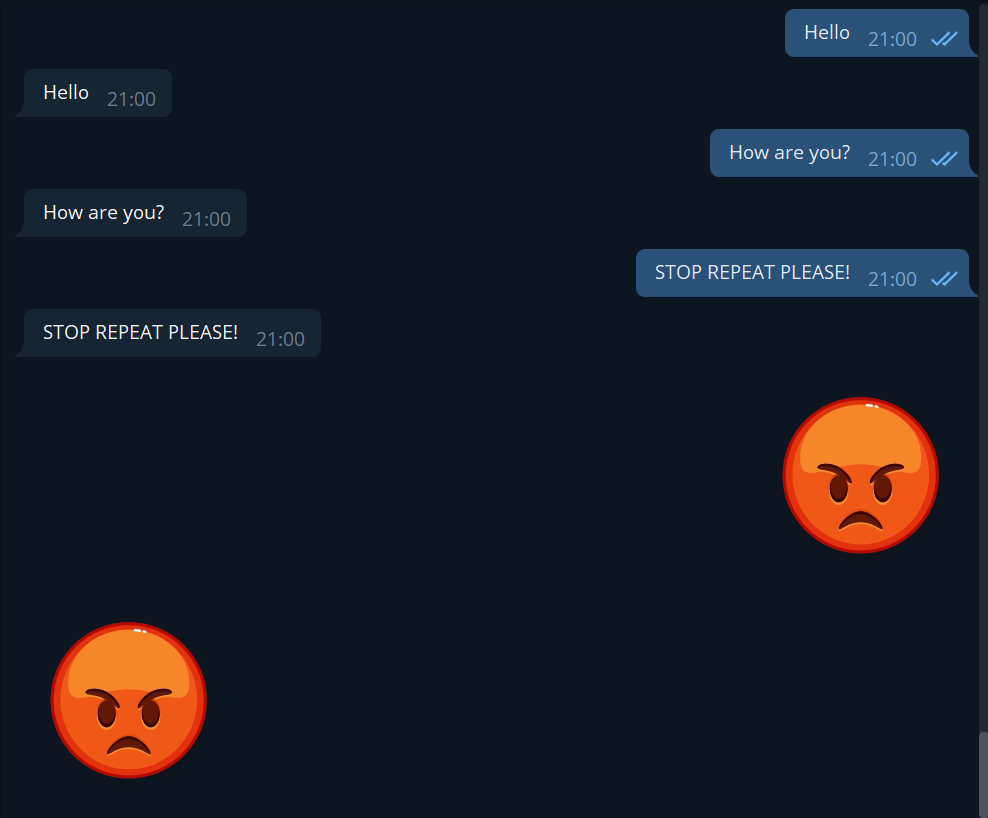

<h1 align="center">
   🤖 Telegram.NET 💬
</h1>

<p align="center">
    Hey! This is new Telegram API wrapper for .NET!
</p>

<p align="center">
    
</p>

If you want to test it you can install NuGet package:

`Package manager`:

```
Install-Package TelegramDotNet -Version 0.5.3
```

`.NET CLI`:

```
dotnet add package TelegramDotNet --version 0.5.3
```

<h2>
   🧰 Tech info 
</h2>

- Language: C#
- Version of language: 9.0
- Target framework: .NET 5.0

<h2>
    ❓ Why Telegram.NET?
</h2>

`Telegram.NET` is a flexible API wrapper. You can create your own extensions for library without contributing. For example, you can create a command service to create command easier. Also, if you don't want to create your own extensions, you can get <a href="https://github.com/denvot">DenVot</a>'s extensions for library. With `Telgram.NET` you can use classes wich provides interfaces for Telegram API. For example, if you have a `ITelegramChannel` instance, you can send a message to specified channel:

```csharp
await chat.SendMessageAsync("This is my first message! Yeah 👏"); //Realy easy!
```

<h2>

<h1 align="center">
    ✍️ Contributing ✍️
</h1>

If you want to contribute, the first thing you should do is clone this repository, create some cool stuff, create unit tests for this stuff, and create pull request.

<h1 align="center">
    🚀 Quick start 🚀
</h1>

First, we should initialize a new instance of `TelegramClient` like this:

```csharp
var client = new TelegramClient("<YOUR_SECRET_TOKEN_HERE>");
```

We need to make sure everything working right. Try to get your client as `TelegramUser`.

```csharp
var me = client.Me;

Console.WriteLine(me);

/*
Output:
    User thebestbot with id 777
*/
```

If you want to get messages you should use method `TelegramClient.Start()` like this:

```csharp
client.Start();
```

If you want stop receiving:

```csharp
client.Stop();
```

---

<h2>
💻 Full code:
</h2>

```csharp
var client = new TelegramClient("<YOUR_SECRET_TOKEN_HERE>");
var me = client.Me;

Console.WriteLine(me);
client.Start();

Console.WriteLine("Press any key to stop bot.");
Console.ReadKey();
client.Stop();
```

## <h2 align="center"> Congrats! You've created your first bot! 🥳 </h2>

---

<h1 align="center">
🤫 More interesting features 🤫
</h1>

So, we started our fist bot, nice. But our bot can't do anything! Let's create simple repeater bot.

```csharp
namespace TheBestBotEverCreated
{
    public class Programm
    {
        public static void Main(string[] args)
        {
            var client = new TelegramClient("<YOUR_SECRET_TOKEN_HERE>");
            var me = client.Me;

            Console.WriteLine(me);
            client.Start();

            client.OnMessageReceived += OnMessage;

            Console.WriteLine("Press any key to stop bot.");
            Console.ReadKey();
            client.Stop();
        }

        public async Task OnMessage(TelegramMessage message)
        {
            var chat = message.Chat;

            await chat.SendMessageAsync(message.Text);
        }
    }
}
```

<p align="center">
    
</p>
